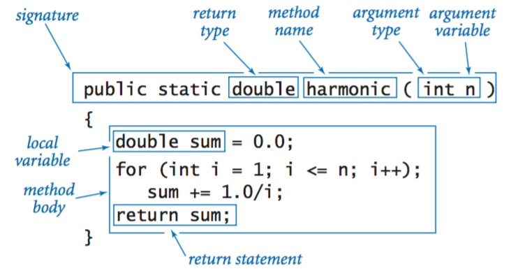

# metodo

* Termine caratteristico dei linguaggi OOP
* Un  **insieme  di   istruzioni   con un nome** 
* Uno  strumento  per  risolvere gradualmente i problemi  scomponendoli  in **sottoproblemi**
* Uno strumento per **strutturare**  il codice
* Uno strumento per **ri-utilizzare** il lavoro già svolto
* Uno  strumento per rendere il **programma più chiaro** e leggibile

---

## Componenti dei metodi

Più in generale, le dichiarazioni di metodo hanno **sei** componenti (alcuni sono opzionali), nell'ordine:

* **Modificatori**, come public, private e altri che imparerai in seguito.
* Il **tipo restituito**: il tipo di dati del valore restituito dal metodo o void se il metodo non restituisce un valore.
* Il **nome del metodo**: le regole per i nomi dei campi si applicano anche ai nomi dei metodi, ma la convenzione è leggermente diversa.
* L'**elenco di parametri** tra parentesi: un elenco delimitato da virgole di parametri di input, preceduti dai rispettivi tipi di dati, racchiusi tra parentesi (). Se non sono presenti parametri, è necessario utilizzare parentesi vuote.
* Un **elenco di eccezioni**, opzionali, da discutere in seguito.
* Il **corpo del metodo**, racchiuso tra parentesi graffe: il codice del metodo, inclusa la dichiarazione delle variabili locali, va qui.

# Differenza tra Override e Overload in Java

In Java, l'**overloading** e l'**override** sono due meccanismi fondamentali che permettono di definire metodi con lo stesso nome, ma con funzionalità distinte. Ecco le differenze chiave:

## Overloading (Sovraccarico)

* **Definizione**:
    * L'overloading si verifica quando una classe contiene più metodi con lo stesso nome, ma con *firme* diverse. La firma di un metodo è determinata dal numero, dal tipo e dall'ordine dei suoi parametri.
    * In sostanza, si tratta di definire più versioni dello stesso metodo all'interno della stessa classe.
* **Scopo**:
    * Fornire flessibilità, consentendo di chiamare lo stesso metodo con diversi tipi di input.
    * Migliorare la leggibilità del codice, evitando di dover creare nomi di metodi completamente diversi per operazioni simili.
* **Esempio**:
    * Un metodo `somma` che può accettare due interi, due numeri in virgola mobile, o un intero e un numero in virgola mobile.

## Override (Sovrascrittura)

* **Definizione**:
    * L'override si verifica quando una sottoclasse (classe derivata) fornisce una specifica implementazione di un metodo che è già definito nella sua superclasse (classe base).
    * Il metodo nella sottoclasse deve avere la stessa firma (nome, numero, tipo e ordine dei parametri) del metodo nella superclasse.
* **Scopo**:
    * Permettere a una sottoclasse di personalizzare o estendere il comportamento ereditato dalla sua superclasse.
    * Implementare il polimorfismo, consentendo di trattare oggetti di diverse sottoclassi in modo uniforme.
* **Esempio**:
    * Una superclasse `Animale` con un metodo `faiVerso()`. Le sottoclassi `Cane` e `Gatto` possono sovrascrivere `faiVerso()` per emettere il suono specifico di ciascun animale.

## Differenze riassuntive

* **Dove avviene**:
    * Overloading: All'interno della stessa classe.
    * Override: Tra una superclasse e una sottoclasse.
* **Firma del metodo**:
    * Overloading: La firma deve essere diversa.
    * Override: La firma deve essere identica.
* **Scopo principale**:
    * Overloading: Fornire metodi con funzionalità simili ma input diversi.
    * Override: Personalizzare il comportamento ereditato.

In Java, l'annotation `@Override` può essere utilizzata per indicare esplicitamente che un metodo intende sovrascrivere un metodo della superclasse. Questo aiuta a prevenire errori, poiché il compilatore segnalerà se il metodo non sovrascrive effettivamente nulla.