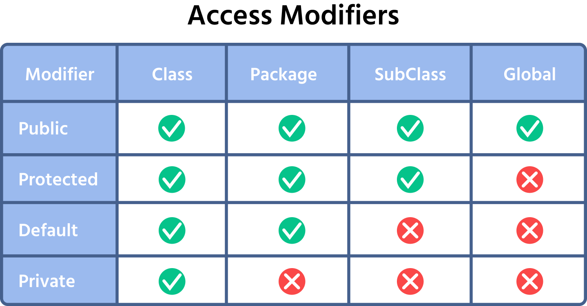

# Incapsulamento in JAVA
Uno dei quattro pilastri fondamentali della programmazione orientata agli oggetti (OOP), insieme a ereditarietà, polimorfismo e astrazione.

### Cos'è
L'incapsulamento è il principio di raggruppare i dati (variabili/attributi) e i metodi (funzioni/comportamenti), che operano su quei dati, all'interno di una singola classe. Allo stesso tempo, l'incapsulamento implica la restrizione dell'accesso diretto ai componenti interni (dati) di un oggetto.

In pratica, l'incapsulamento significa:

* **Bundling (Raggruppamento)**: Tenere insieme dati e codice che agiscono su quei dati. Una classe è l'unità di incapsulamento.
* **Information Hiding (Nascondere le Informazioni)** : Rendere i dati (variabili di istanza) di una classe privati e fornire metodi pubblici (getter e setter) per accedere e modificare quei dati in modo controllato.

### Come si Realizza l'Incapsulamento in Java?
In Java, l'incapsulamento è principalmente realizzato utilizzando i **modificatori di accesso** e fornendo metodi getter e setter.

